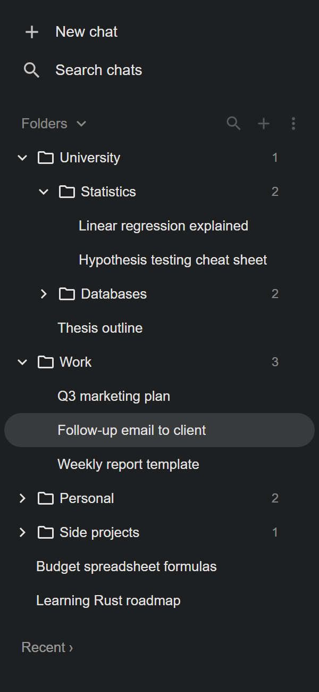
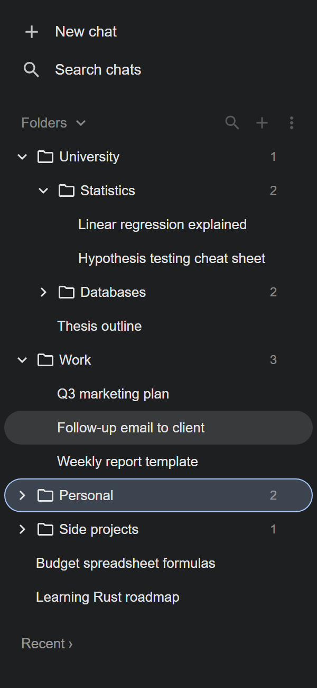
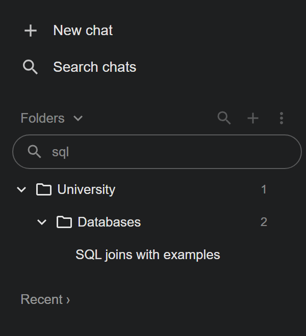
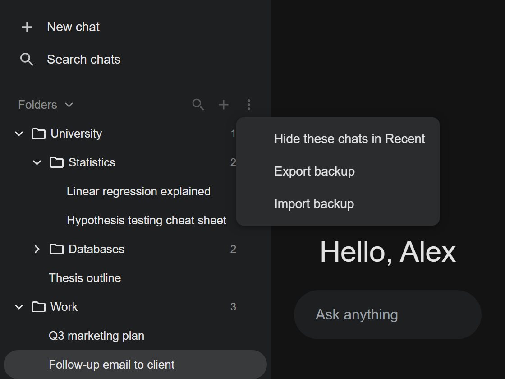

<p align="center">
  
</p>

<h1 align="center">GeminiFolders</h1>

<p align="center">

[](https://github.com/miguelsiilva1/GeminiFolders/actions/workflows/ci.yml)
[](https://github.com/miguelsiilva1/GeminiFolders/releases/latest)
[](LICENSE)

</p>

**Organize your Google Gemini chats into folders, right in the Gemini sidebar.**
Drag and drop chats, nest folders, search, and keep everything in sync across your computers.

GeminiFolders is a small, privacy-first Chrome extension. It only changes how the Gemini page looks in
your own browser: it makes no network requests, doesn't use Gemini's internal APIs, and never reads
your conversations.

> Independent project, not affiliated with or endorsed by Google. Gemini is a trademark of Google LLC.

<p align="center">
  
</p>

---

## Contents

- [Features](#features)
- [Installation](#installation)
- [Sync across computers](#sync-across-computers)
- [Usage](#usage)
- [Privacy and security](#privacy-and-security)
- [Limitations](#limitations)
- [How it works](#how-it-works)
- [Development](#development)
- [Releasing](#releasing)
- [License](#license)

## Features

- **Folders in the sidebar**: a _Folders_ section above Gemini's _Recent_ list, with subfolders up to 3 levels deep.
- **Drag and drop**: drag chats from _Recent_ into folders, reorder chats and folders, nest folders, or move them back to the top level.
- **Chats without a folder**: keep loose chats at the top level, in your own order next to your folders.
- **Search**: filter folders and chats by name. Accents and case are ignored, and folders with matches open automatically.
- **Hide organized chats**: optionally hide chats that are already in _Folders_ from the _Recent_ list.
- **Sync across computers**: folders, order and chat titles follow your Google account through Chrome Sync.
- **Backups**: export everything to a JSON file and import it back.
- **Native look**: follows Gemini's light and dark themes and its language (English and Portuguese).

| Drag chats into folders | Search | Header menu |
| :---: | :---: | :---: |
|  |  |  |

<sub>Screenshots use example data.</sub>

## Installation

GeminiFolders isn't on the Chrome Web Store. Install it from a GitHub release:

1. Download `gemini-folders-<version>-chrome.zip` from the [latest release](https://github.com/miguelsiilva1/GeminiFolders/releases/latest).
2. Unzip it into a folder you'll keep, for example `Documents/GeminiFolders`. Chrome loads the extension from that folder.
3. Open `chrome://extensions` and turn on **Developer mode** (top right).
4. Click **Load unpacked** and select the unzipped folder.
5. Open [gemini.google.com](https://gemini.google.com). The _Folders_ section appears in the sidebar.

Tested in Google Chrome. It should also work in other Chromium browsers (Edge, Brave).

> Chrome may show a banner about extensions in developer mode when it starts. It's safe to dismiss;
> don't choose to disable the extension.

### Updating

1. Download the new release zip.
2. Replace the contents of your extension folder with it.
3. Click **↻** (reload) on the GeminiFolders card in `chrome://extensions`.

Your folders are kept: every build has the same extension ID, so Chrome treats it as the same extension.

## Sync across computers

Changes are saved to `chrome.storage.sync` and reach your other computers automatically, usually within
10–30 seconds. Nothing needs to be exported or imported.

On each computer:

1. Sign in to Chrome with the **same Google account**.
2. In Chrome settings → **Sync**, make sure **Extensions** is turned on.
3. Install GeminiFolders as described above.

**What syncs:** folders, their order, which chats they hold, and the titles of those chats.
**What stays on each computer:** which folders are collapsed, the _hide organized chats_ option, and the title cache of other chats.

## Usage

| Action                           | How                                                                                                               |
| -------------------------------- | ----------------------------------------------------------------------------------------------------------------- |
| New folder                       | **+** in the _Folders_ header, type a name and press Enter (Esc cancels)                                          |
| Add a chat to a folder           | Drag it from _Recent_ onto the middle of a folder, or use a folder's **⋮** → _Add current chat_                   |
| Add a chat without a folder      | Drag it onto the _Folders_ header, or above or below another item                                                 |
| Reorder                          | Drag onto the top or bottom half of an item; a line shows where it will land                                      |
| Subfolder                        | Drag a folder onto the middle of another folder, or use **⋮** → _New subfolder_                                   |
| Rename or delete a folder        | **⋮** on the folder. Deleting needs a second click, and its contents move up a level                              |
| Remove a chat from the panel     | Hover it and click **×** (this never deletes the chat in Gemini)                                                  |
| Open a chat                      | Click it. Ctrl/Cmd+click opens it in a new tab                                                                    |
| Search                           | 🔍 in the header. Esc closes it                                                                                   |
| Hide organized chats in _Recent_ | Header **⋮** → _Hide these chats in Recent_                                                                       |
| Back up or restore               | Header **⋮** → _Export backup_ / _Import backup_. Import replaces the current folders and asks for a second click |

## Privacy and security

GeminiFolders is built to be minimal and inspectable:

- **Permissions**: only `storage`, and only on `https://gemini.google.com/*`. No access to tabs, history, cookies or other sites.
- **No network**: the extension never sends a request. It has no analytics, no telemetry and no remote code.
- **Minimal data**: it reads only the chat links and titles shown in Gemini's sidebar, never message content, prompts or account details.
- **Where data lives**: folder structure and titles of chats in folders go in `chrome.storage.sync`, synced by Chrome through your Google account. View preferences and the title cache go in `chrome.storage.local`. Nothing goes to any server run by this project.
- **Low account risk**: it doesn't call Gemini's internal APIs or automate anything, so Google only sees a normal browser session.
- **Isolation**: the panel lives in a closed Shadow DOM, and the content script runs in Chrome's isolated world. No files are exposed to the page as web-accessible resources.
- **Safe rendering**: chat titles are always rendered as text, never as HTML.
- **Validated input**: imported backups and synced data are checked against a strict schema. That covers size limits, ID formats, and the folder tree itself (no duplicates, no loops, depth of 3 or less).
- **Guarded builds**: CI fails if the manifest gains any permission or host access, and runs `npm audit` on every push and release.

Found a security issue? Please report it in a [GitHub issue](https://github.com/miguelsiilva1/GeminiFolders/issues).

## Limitations

- Folders exist only in the extension. They don't appear in the Gemini mobile app or in browsers without GeminiFolders.
- Gemini's own _Recent_ list keeps Gemini's order; it can't be reordered. Use chats without a folder to arrange them yourself.
- A chat's title is known once it has appeared in Gemini's sidebar on one of your computers.
- GeminiFolders depends on Gemini's page structure. If Google redesigns the sidebar the panel may stop showing until an update, but it never breaks Gemini itself.
- Chrome Sync allows about 100 KB per extension, enough for a few thousand chats. A single folder holds about 400 chats.

## How it works

```
gemini.google.com
└─ Content script (isolated world)
   ├─ dom/      Reads chat links and titles from the sidebar, tracks the open chat.
   │            All knowledge of Gemini's markup lives in dom/selectors.ts.
   ├─ store/    Folder tree operations, validation, sync storage, search, backups.
   └─ ui/       Preact panel in a closed Shadow DOM: folder tree, drag and drop, menus.
```

- **Drag and drop** uses the browser's native drag events. Gemini's chat links are already draggable and carry their URL, so a drop only needs to read the chat ID from the dragged link. Gemini's page isn't modified.
- **Storage** keeps one sync item per folder, so each stays under Chrome's 8 KB per-item limit. Only changed items are written, with a 500 ms delay between saves.
- **Stable ID**: a fixed public key in the manifest gives every install the same extension ID, which lets them share synced data.

## Development

Requires **Node.js 24+**.

```bash
npm install          # install dependencies (also generates WXT types)
npm run build        # build to .output/chrome-mv3
npm test             # unit and UI tests (Vitest + happy-dom)
npm run typecheck    # TypeScript strict mode
npm run check:manifest   # verify the built manifest's permissions
npm run zip          # package .output/gemini-folders-<version>-chrome.zip
npm run icons        # render assets/logo.svg to the extension icons
npm run demo         # demo page with example data (used for the README screenshots)
```

Load `.output/chrome-mv3` with **Load unpacked** in `chrome://extensions`. After each build, click **↻** on the extension and reload Gemini.

**Stack:** [WXT](https://wxt.dev) (Manifest V3), TypeScript, [Preact](https://preactjs.com) with signals, [Zod](https://zod.dev), Vitest.

```
entrypoints/content/   Content script entry: wires the scanner, store and panel
src/dom/               Gemini page integration (selectors, scanner, navigation)
src/store/             State, operations, sync, search, backups
src/ui/                Panel components, drag and drop, styles, translations
tests/unit/            Unit and UI tests
scripts/               Build checks and icon rendering
public/icon/           Extension icons (generated from assets/logo.svg)
assets/                Logo and README screenshots
demo/                  Demo page with example data
```

When Google changes Gemini's markup, update `src/dom/selectors.ts`. It is the only file that knows the page structure.

## Releasing

1. Update `version` in `package.json` and commit.
2. Tag and push:
   ```bash
   git tag v1.2.3
   git push origin v1.2.3
   ```
3. The **Release** workflow runs the audit, typecheck, tests and manifest check, then publishes the zip as a GitHub release.

## License

[MIT](LICENSE) © 2026 Miguel Silva
